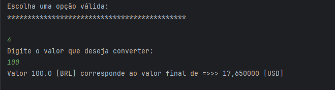
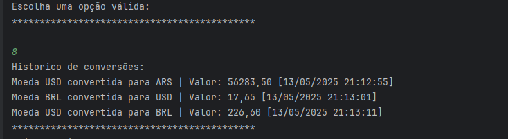

# 💱 Challenge Conversor de Moedas

Aplicação em Java para conversão de moedas em tempo real, utilizando a API ExchangeRate.

---

## 🚀 Tecnologias Utilizadas

- Java
- API ExchangeRate (https://www.exchangerate-api.com/)
- Bibliotecas externas (disponíveis na pasta `dependencia`)

---

## 🎯 Funcionalidades

- Converte Dólar (USD) para Real Brasileiro (BRL)
- Converte Real Brasileiro (BRL) para Dólar (USD)
- Converte Dólar (USD) para Peso Argentino (ARS) e vice-versa
- Converte Dólar (USD) para Peso Colombiano (COP) e vice-versa
- Permite escolher manualmente moedas para conversão, utilizando seus respectivos códigos (ex: `USD`, `EUR`, `BRL`)
- Exibe um histórico de conversões realizadas

---


## 🛠️ Como Executar o Projeto


1. **Clone o repositório:**

   ```bash
   git clone https://github.com/gbl-pedroso/Challenge-Conversor-de-Moeda.git


2. **Abra o projeto no IntelliJ IDEA (ou outra IDE Java compatível).**


3. **Adicione as bibliotecas do projeto:**
   - Vá em: `File > Project Structure > Modules`
   - Importe todas as bibliotecas da pasta `dependencia`


4. **Configure a chave da API como variável de ambiente:**
   - Nome da variável: `EXCHANGERATE_API_KEY`
   - Valor: sua chave obtida em [exchangerate-api.com](https://www.exchangerate-api.com/)
  


## 🖼️ Demonstração


### Menu Principal


### Exemplo de Conversão: BRL → USD



### Mostrar Historico de Conversões



 ## 📝 Licença

Este projeto está licenciado sob a **MIT License** — você pode usar, modificar e redistribuir com os devidos créditos.


## 👨‍💻 Autor

**Gabriel Pedroso**  
GitHub: [@gbl-pedroso](https://github.com/gbl-pedroso)
